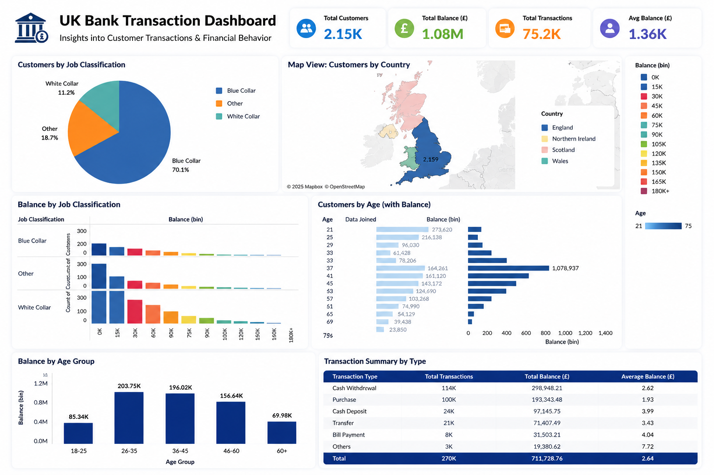

# 🏦 UK Bank Transaction Analytics Dashboard

## 📌 Project Overview

This project presents an interactive UK Bank Transaction Analytics Dashboard developed using Tableau. The dashboard analyzes customer transaction data to provide insights into customer demographics, account balances, job classifications, and financial behavior. It enables users to monitor banking trends through interactive visualizations and business intelligence techniques.

---

## 📷 Dashboard Preview

---

## 🎯 Business Objective

The objective of this dashboard is to analyze customer banking data, identify customer distribution, understand account balance patterns, and support data-driven financial decision-making through interactive visualizations.

---

## 📊 Key Performance Indicators (KPIs)

- Total Customers
- Total Account Balance
- Total Transactions
- Average Account Balance

---

## 📈 Dashboard Insights

- Blue Collar customers represent the largest customer segment.
- Customer balances vary significantly across different job classifications.
- Most customers belong to the age group between 26–45 years.
- Geographic distribution highlights customer concentration across UK regions.
- Transaction summaries provide an overview of customer banking activities.

---

## 🛠️ Tools & Technologies

- Tableau
- Microsoft Excel / CSV
- Data Visualization
- Business Intelligence
- Data Analysis

---

## 📂 Dataset

The dataset contains banking customer information including:

- Customer ID
- Age
- Gender
- Job Classification
- Region
- Balance
- Date Joined
- Transaction Details

---

## 📌 Dashboard Features

- Interactive Dashboard
- Customer Segmentation
- Geographic Map Visualization
- Job Classification Analysis
- Balance Distribution
- Age-wise Customer Analysis
- Transaction Summary
- KPI Cards

---

## 💡 Skills Demonstrated

- Data Cleaning
- Data Visualization
- Dashboard Design
- Tableau
- Business Intelligence
- Exploratory Data Analysis (EDA)
- Insight Generation
- Interactive Reporting

---

## 🚀 Project Outcome

Developed an interactive banking analytics dashboard that helps visualize customer demographics, account balances, regional distribution, and transaction behavior, enabling better understanding of customer financial patterns.

---

## 📁 Repository Contents

- dashboard-overview.png
- uk-bank-transactions.csv
- README.md

---

## 👩‍💻 Author

**Urmila Bhere**

- 📍 Mumbai, India
- 💼 Aspiring Data Analyst
- 🔗 LinkedIn: https://www.linkedin.com/in/urmilabhere
- 💻 GitHub: https://github.com/bhereurmila

---

⭐ If you found this project interesting, feel free to explore the repository and connect with me.
